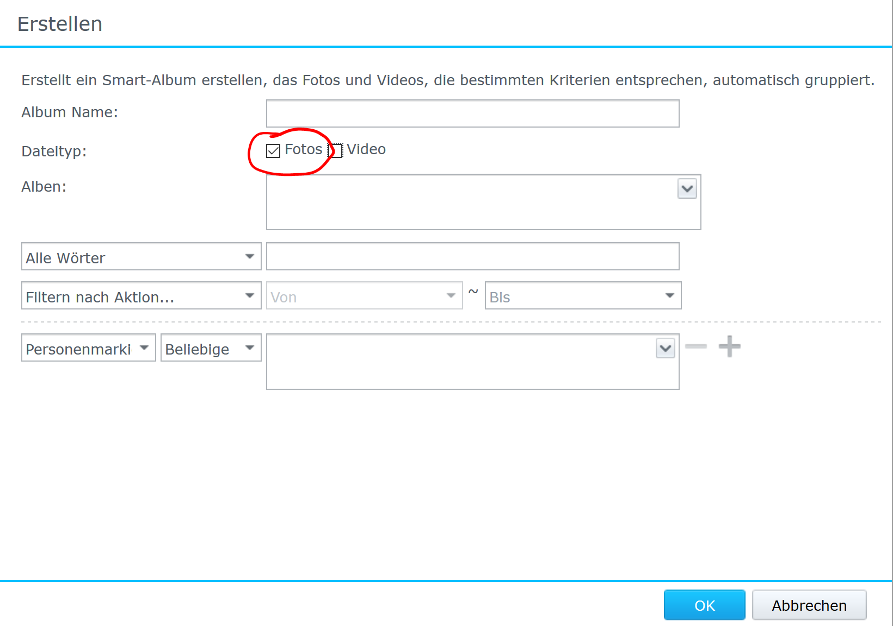

# PhotoStation Frame

## Overview

The PhotStation Frame is a digital picture frame software as UWP app with support for Windows IoT Core with a special look at Raspberry Pi 3 that accesses your Synology DiskStation with installed PhotoStation software.

:heavy_exclamation_mark: **Early Alpha** :heavy_exclamation_mark:

I started with the app because all my images are stored on my Synology and most of time thats it. While sitting in my dads kitchen I saw one of the "oldshool" digital picture frames working wiht memory stick. I have one of these too but never have time to update the images on stick. That was the time the idea came up to hack something to connect to my Synology. 

So I wrote these UWP App first showing pictures of one special album what was not verry handy. But the usage of a smart album is realy cool because you can adjust the images shown with the album filter. I tried a filter depending on a given Tag but using a five star filter was more easy. You could also try a time filter. 

**There is one point with using a smart album. Please make sure to select only pictures**

### Preconditions 
- Synology DiskStation with Phote Station 6
- Windows 10 (Fall Creators Update+)
- Visual Studio with Windows Universal Platform Toolset (2017+)

### Features

- Runs on Raspberry Pi with Windows IoT Core (Tested on RPi3)
- Support for HTTP & HTTPS 
- Show albums and smart albums (photo only)
- Random sorting 
- Supports larg image sets (Tested with 18k images from smart album an RPi3)
- Experimentel Support of Portait mode

### Known issues

- Smart album with video crash while parsing JSON

## Setup

- Clone the repo
- Open the project 
- Selecte PhotoStationFrame.Uwp as startup project 
- Hit F5 

For remote deployment to Windows IoT core like Raspberry Pi you need: 

- everything from above
- [Setup your device with Windows 10 Iot core](https://docs.microsoft.com/en-us/windows/iot-core/tutorials/quickstarter/devicesetup)
- [Configure remote debug](https://docs.microsoft.com/en-us/windows/iot-core/develop-your-app/appdeployment#deploy-a-c-app-to-your-windows-10-iot-core-device)
- Hit F5 and wait some seconds

## Roadmap

### Planned
- Add Companion App for Configuration over BLE (Xamarin.Forms)
- Build hardware picture frame and publish HowTo/Documentation 
- Add image assets and publish app to store
- Energy management (QuitHours, MonitorPowerControl - Hardware)
- Add I2C Accelerometer Sensor for Portait and Landscape Support 
- Image caching

### v.NextNext 

- German localization
- VoiceControl
- Presence Sensor for power control 
- Support for other Cloud providers
- Some cool stuff with [VisionService](https://azure.microsoft.com/en-us/services/cognitive-services/directory/vision/)
- Some cool WinML stuff 
- Cross Plattform App
- Video support

